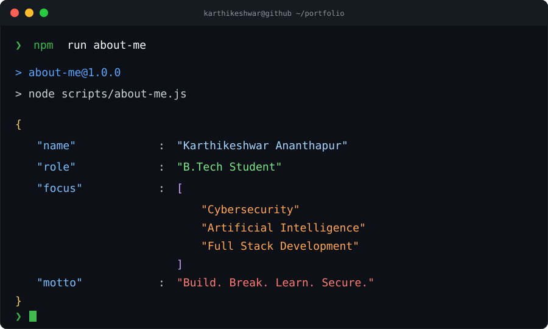
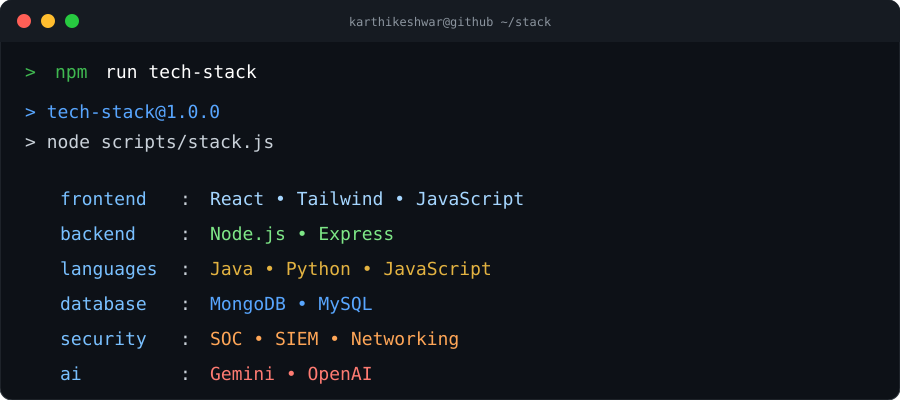
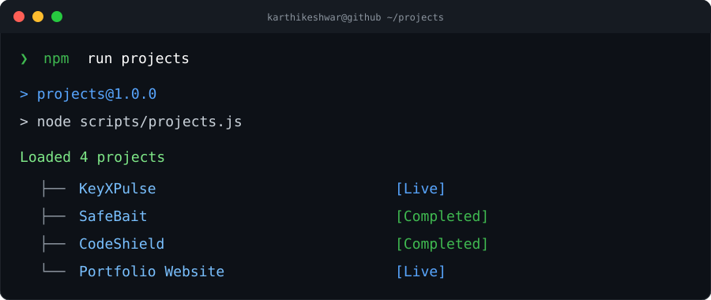
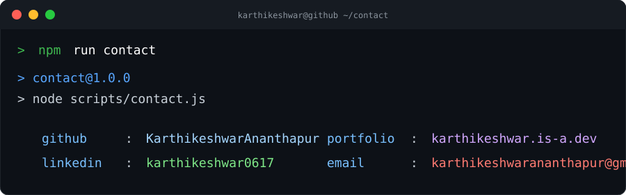

  

 

 

 

 

 

<h2 align="center">📈 GitHub Analytics</h2>

    

 

<h2 align="center">🌐 Connect With Me</h2>

  

  

  

  

---

### 🚀 Building the future, one project at a time.

*Build. Break. Learn. Secure.*

